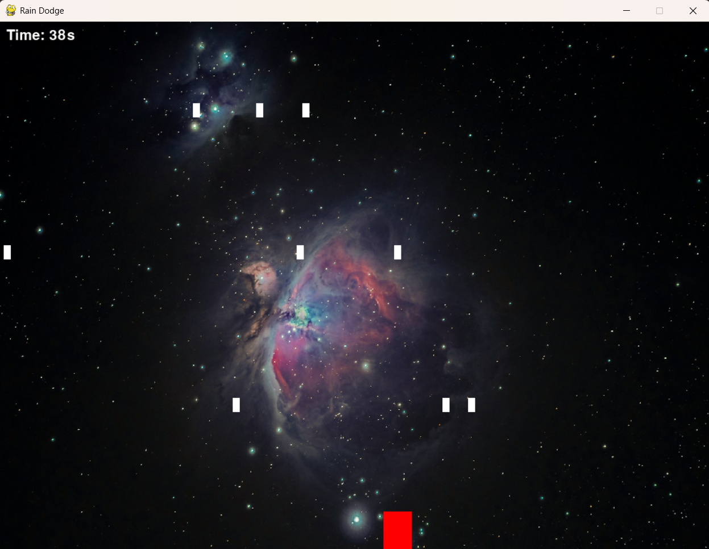
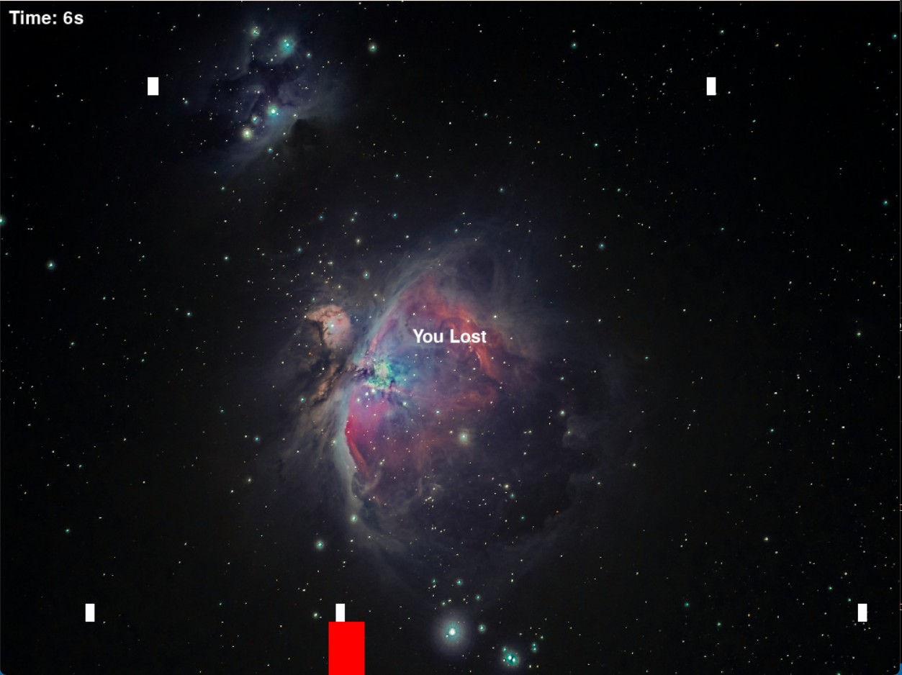

# Space Dodge

A simple arcade-style game where you control a block dodging falling objects.

## Screenshots



<br/>



## How to Play

- Use **LEFT** and **RIGHT** arrow keys to move the red block
- Dodge the white falling objects for as long as possible
- The game ends when you get hit
- Your survival time is displayed in the top-left corner

## Game Features

- Increasing difficulty over time (objects fall faster as you survive longer)
- Simple one-button controls
- Clean, minimalist visuals
- Space/galaxy themed background

## Installation

1. Make sure you have Python installed (3.6+ recommended)

2. Install pygame:
```bash
pip install pygame
```

3. Run the game:
```bash
python main.py
```

## Requirements

- Python 3.x
- Pygame library
- Background image file (`bg2.jpg`) in the same directory

## Project Structure

```
├── main.py          # Game logic and loop
├── bg2.jpg          # Background image
└── screenshots/     # Gameplay screenshots
```

## Controls

| Key | Action |
|-----|--------|
| ← | Move left |
| → | Move right |

## How It Works

The game spawns falling objects at random horizontal positions. The spawn rate and speed gradually increase over time, making survival progressively harder. Your time is tracked from the moment the game starts until you collide with an object.

## License

[MIT](LICENSE)
